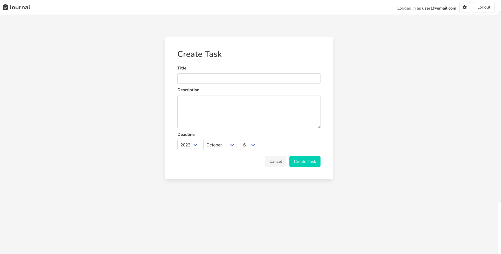

# journal-app

A Ruby on Rails application that allows the user to create tasks based on different categories.

## Tech Stack

- Ruby on Rails
- Bulma

## Features

- Sign in and register an account
- Create categories
- Create tasks
- Filter tasks based on urgency

### Live Demo: https://journal-app.onrender.com
